This article has been update to use **Astro 3** and **Strapi 4** by Paul Bratslavsky.

You can find the completed project [here](https://github.com/PaulBratslavsky/strapi-astro-blog-post).

## What is Astro ?

Astro is another JavaScript-based static site generator, but ships ZERO JavaScript to the client by default. Astro provides a frictionless developer experience to get started as it allows you to bring your framework to build sites and has Astro components.

Thats right!

You can use HTML, React, Angular, Svelte, or Vue or together at any point in the project to build a super-fast and SEO-friendly website.

What's unique about Astro compared to other static site generators is its first-class support for loading JavaScript on-demand.

The concept is called [Progressive Enhancement/Partial Hydration](https://docs.astro.build/core-concepts/component-hydration/). Unlike other correctly frameworks like Next.js or Gatsby, Astro assumes your site will always be static and gives the flexibility to load JavaScript if and when needed only.

In addition to all that, Astro has out of the box support for

- Stying with CSS Modules, Sass and Tailwind,
- TypeScript
- Markdown
- MDX files
- RSS feeds
- pagination.

It comes with everything needed to build a site without adding or configuring libraries that support the above, a great starter into the world of JAM Stack.

Assuming that introduction got you interested in Astro, let move ahead and build something with it.

## **What to expect from this tutorial?**

In this tutorial, we will be learning to build a blogging application using Strapi as the CMS and Astro powered by HTML to build the frontend.


Why a blog application? When playing around with a new technology building, a decoupled blog application encompasses all the concepts you will need to know to build any web application from database concepts, web APIs, and frontend design and development.

While this tutorial is beginner-friendly, you'll need to have/do the following before you can follow along

- Basic understanding of HTML and CSS.
- Basic understanding of [Strapi](https://docs.strapi.io/developer-docs/latest/getting-started/introduction.html).
- Familiarity with [Tailwind CSS classes](https://tailwindcss.com/docs).
- Skim through the syntax of [Astro](https://docs.astro.build/core-concepts/astro-components/)
- Have one of these Node.js versions installed - v18.0.0, or higher.

## Setting up the Backend

In this section, we are going to set up our backend using Strapi. Strapi is an open-source headless CMS that allows to bootstrap RESTful API in a matter of minutes.

Additionally, it comes with a GUI (CMS), which helps manage different content types. This makes Strapi a great choice to quickly build an application and manage content.

**Creating a Strapi Project**
To create a Strapi project, run one of the following commands in your terminal.

```bash
    yarn create strapi-app@latest headless-blog --quickstart
    #OR
    npx create-strapi-app@latest headless-blog --quickstart
```

Using the `--quickstart` flag will set Strapi to use an SQLite database under the hood to skip setting up a database instance.

After the Strapi project has been created, in the same terminal, move into the newly created project by typing.

```
    cd headless-blog
```

And run the project in the development mode using either of the following commands.

```bash
    yarn develop
    # OR
    npm run develop
```

After running the above command, you will be taken to [http://localhost:1337/admin](http://localhost:1337/admin) to create the first administrator account.

Fill in the necessary details.

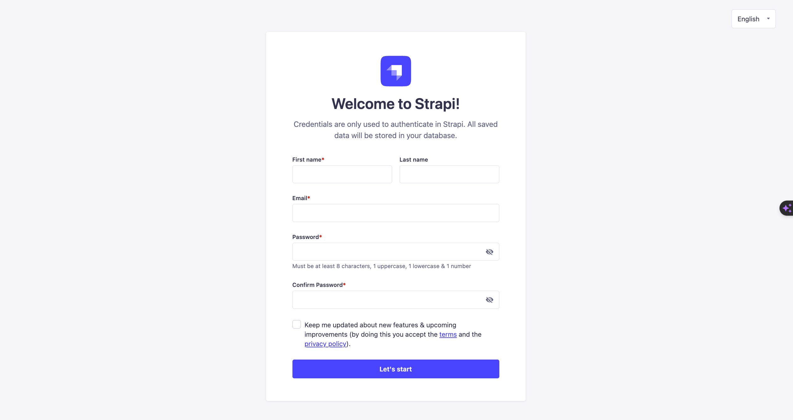

After you have filled in the details, you will be taken to the admin panel.


We are good to go!

**Creating Collection Types**

Collection Types in Strapi are the content type that is used to define the structure to hold data. You can analogize this to be tabled in a database.

To create a Collection, Strapi comes built-in with a [Content-Type Builder](https://docs.strapi.io/user-docs/latest/content-types-builder/introduction-to-content-types-builder.html). The Content-Types Builder can be accessed from `Plugins > Content-Types Builder` in the main navigation of the admin panel.

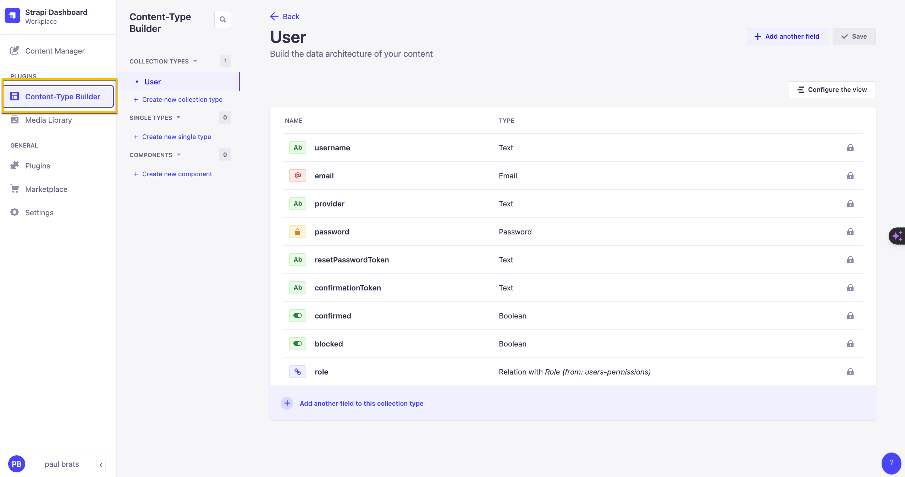

Let's breakdown the collections we are going to create with their fields

1. Category - the different categories of posts

- Name
- Slug

1. Author - the writer of the Post

- Name
- Bio
- Image

1. Post - the content

- Title
- Content
- Featured Image
- Excerpt
- Reading Time - (this we will automatically update based on the content)
- Slug
- Categories
- Author

You might notice the relationship between the Post to Category and Author. Hence let's initially create Category and Post collection types.

To create our first collection type, click on the Create new collection type button on the `Content-Type` Builder.

A modal (popup) will come up, and you will be prompted to enter the name of the collection type. Keep in mind to name it in the singular, as Strapi automatically pluralizes the word. Click on Continue.

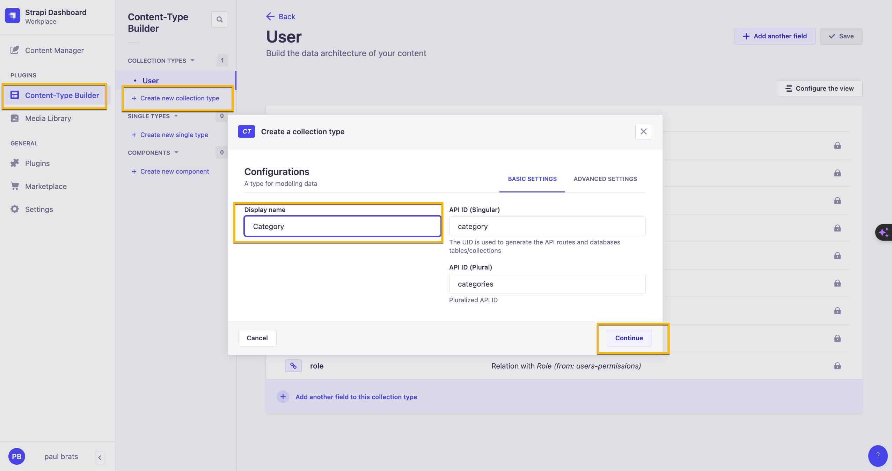

Moving on, you will behave to choose the different field types for the fields we have previously discussed. Select Text.

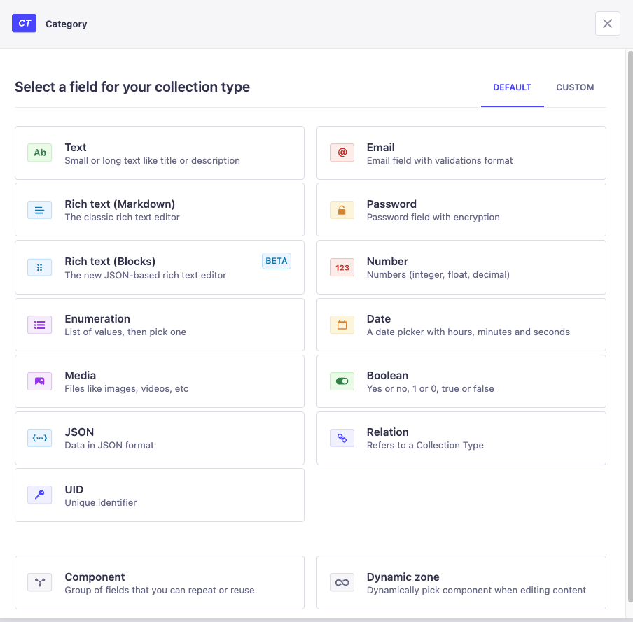

In the following modal, type Name in the name field, select Short Text, and click Add another field.

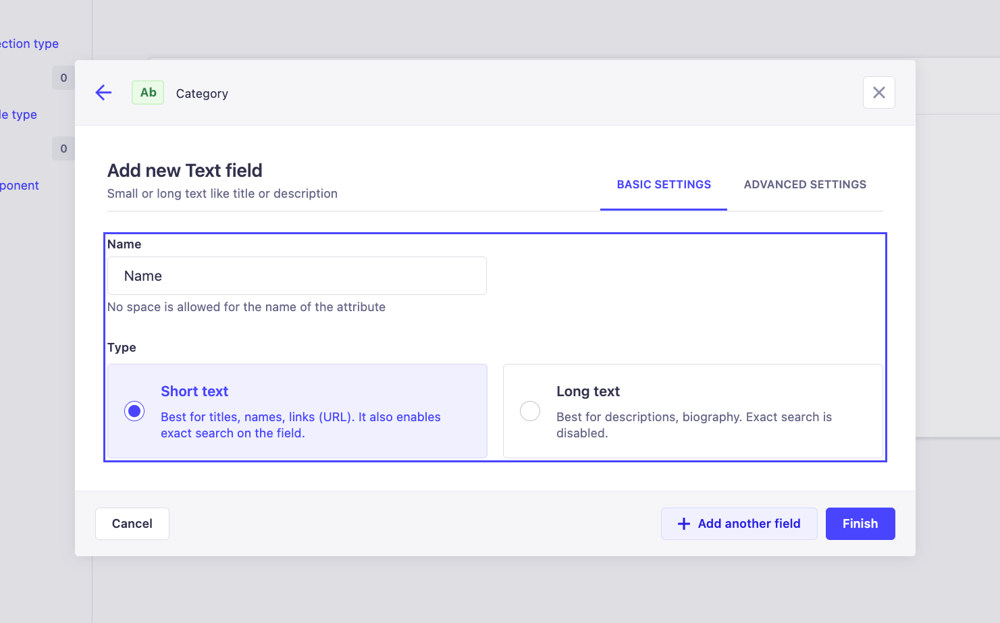

Follow the same for all the other fields we discussed earlier. I will not create all the fields in this tutorial, but I am leaving a couple of screenshots of the collection fields for you to follow.

**Note:** You can omit the post relation in the Category collection as it gets automatically created after we link Category with Post.

If you want to know yourself familiarized with different Field types and the relations between Collection types, read [this section of the Strapi documentation](https://docs.strapi.io/user-docs/latest/content-types-builder/configuring-fields-content-type.html). The documentation covers the types of the different fields why you would choose to use it.

**Creating Collection : Category**

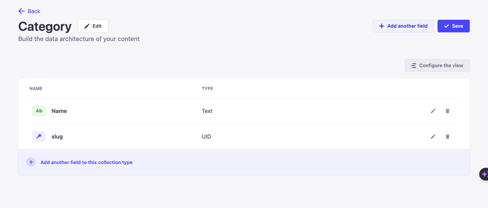

**Creating Collection : Author**

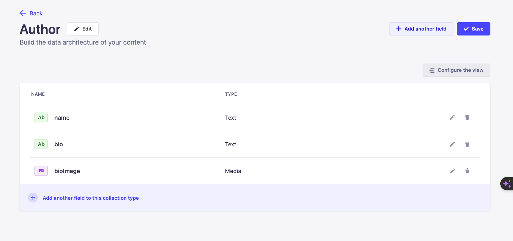

**Creating Collection : Post**


**Relationship : Author - Post**


**Relationship : Category - Post**

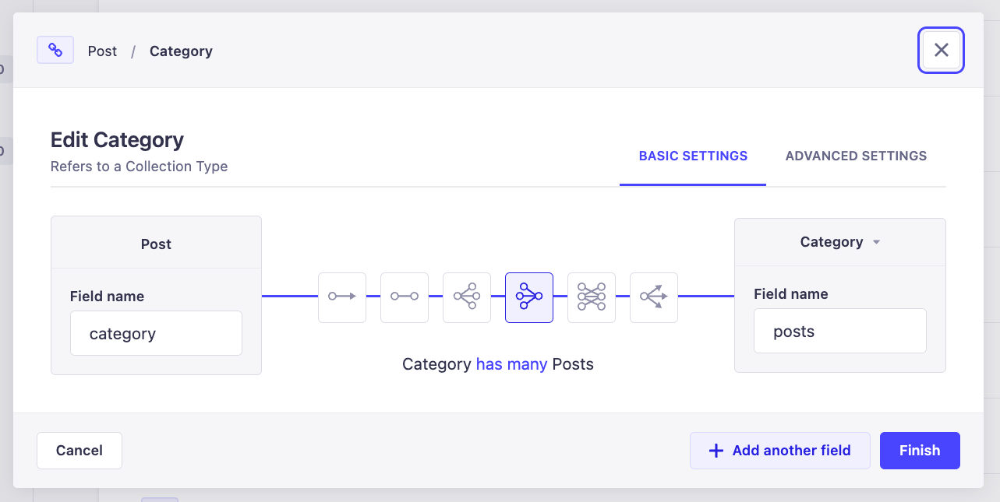

**Setting up Roles and Permission**

Strapi creates CRUD endpoints for all the collection types, but by default, Strapi adds an authorization layer to these endpoints to which we need to grant public access explicitly.

We need to set up our roles and permission to have public access for our front end to fetch the posts. To do this, navigate to `Setting → Users & Permissions Plugin → Public`.

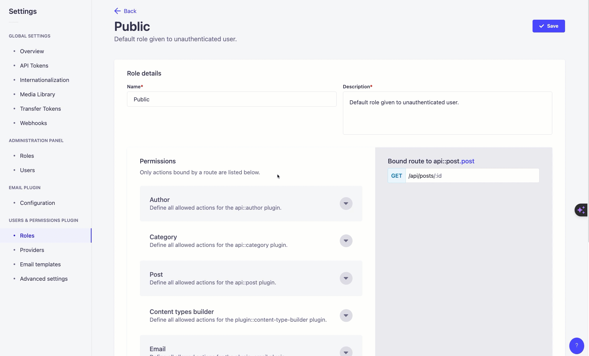

Scroll down and tick the following checkbox under the Permissions section as shown in the below image and click on the Save button at the right top corner.

**Accessing the Post endpoints**

To access any API endpoint in Strapi, we need to append the pluralized name of the collection type to the base URL. In our case, to access the Post, the URL is [http://localhost:1337/api/posts](http://localhost:1337/api/posts). Since we allowed public access to the /posts endpoints, we can access this endpoint. You will see an empty array JSON response if you visit the endpoint since we did not add any posts yet.

```json
{
  "data": [],
  "meta": {
    "pagination": {
      "page": 1,
      "pageSize": 25,
      "pageCount": 0,
      "total": 0
    }
  }
}
```

But before we move further, let modify the Post functionality to automatically add the reading time when a post is created or updated. This can be achieved by modifying the model of Post collection.

**Adding Reading time to Post collection**

Strapi, by default, is extensible; hence it allows us to modify the functionality as we like it. That is why I prefer to see Strapi than more of framework + headless CMS rather than just a headless CMS.

To better understand a Strapi project, look at the [Project Structure documentation](https://docs.strapi.io/developer-docs/latest/setup-deployment-guides/file-structure.html) and the [Backend customization](https://docs.strapi.io/developer-docs/latest/development/backend-customization.html) in the Strapi documentation. There is also a great article on the Strapi YouTube video regarding [Content Modelling in Strapi](https://youtu.be/PDnWCnA6qTg?feature=shared).

To get started, open your Strapi project in your favorite code editor. For this tutorial, I am going to stick to VS Code. After you have opened up the project if you have stopped the Strapi server, restart using `yarn develop`.

Models are a representation of the database's structure. The post.js we will be editing contain [lifecycle hooks](https://docs.strapi.io/dev-docs/backend-customization/models#lifecycle-hooks) or functions triggered when the Strapi queries are called, or any database interactions are made. In our case, we need to update the reading time when a post is created or updated.

Navigate to `src/api/post/content-types/post` and create a new file called `lifecycles.js` and paste the following code.

```javascript
const readingTime = require("reading-time");

module.exports = {
  async beforeCreate(event) {
    console.log("########## BEFORE CREATE ##########");
    if (event.params.data.content) {
      event.params.data.readingTime =
      readingTime(event.params.data.content)?.text || null;
    }
  },

  async beforeUpdate(event) {
    console.log(, "########## BEFORE UPDATE ##########");
    if (event.params.data.content) {
      event.params.data.readingTime =
      readingTime(event.params.data.content)?.text || null;
    }
  },
};
```

We are utilizing the `beforeCreate` and `beforeUpdate` hooks to check if there is content present and, if so, to use the [reading-time](https://www.npmjs.com/package/reading-time) package to calculate the reading time and update the `readingTime` field we configured when we made the Post collection.

If you know different hooks available in Strapi, check out [Understanding the different types/categories of Strapi Hooks](https://strapi.io/blog/understanding-the-different-types-categories-of-strapi-hooks) article on the in-depth guide in working with Strapi hooks.

For this change to take effect and not throw an error, stop the Strapi server and install the `reading-time` package. Open your terminal and type the following command.

```bash
    yarn add reading-time
    #OR
    npm i reading-time
```

To restart start the server type yarn develop or npm run develop

**Finalizing the backend**

We are done with all the needed configuration and setup for our Strapi backend. Before moving to the frontend, let's insert categories and authors and associate them with the respective posts.

Go ahead and create few posts, categories and authors.

I have gone ahead and added five posts and created the respective authors and categories.


Before we move on to our frontend, let look at how /posts API endpoints to view our JSON response.

But first we must populate all of our required fields. You can learn more about **populate** and **filtering** in [this](https://strapi.io/blog/demystifying-strapi-s-populate-and-filtering) blog post.

We will use Strapi's Query Builder tool to help us construct our query string.

You can find it [here](https://docs.strapi.io/dev-docs/api/rest/interactive-query-builder).

**Object Notation:**

```js
{
  populate: {
    featuredImage: {
      fields: ["name", "width", "height", "url"]
    },
    author: {
      populate: {
        bioImage: {
          fields: ["name", "width", "height", "url"]
        }
      }
    },
    category: {
      populate: true,
    },
  },

}
```

[**LHS Notation**](http://localhost:1337/api/posts?populate[featuredImage][fields][0]=name&populate[featuredImage][fields][1]=width&populate[featuredImage][fields][2]=height&populate[featuredImage][fields][3]=url&populate[author][populate][bioImage][fields][0]=name&populate[author][populate][bioImage][fields][1]=width&populate[author][populate][bioImage][fields][2]=height&populate[author][populate][bioImage][fields][3]=url&populate[category][populate]=true)

**Our JSON Response**

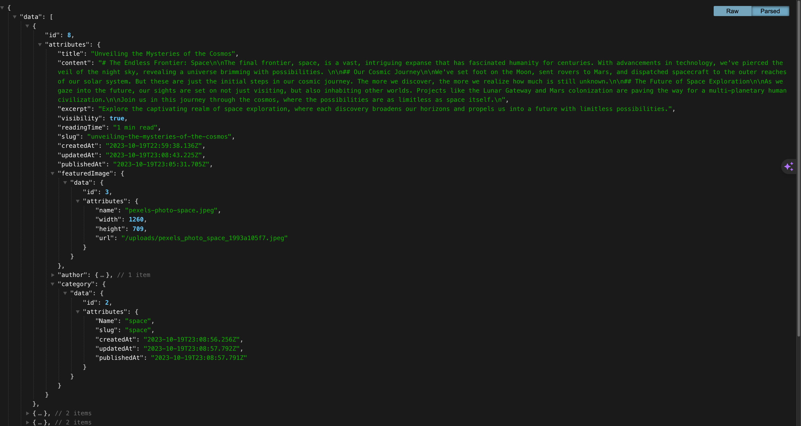

Now that we know that our backend is working, let go forth to the front end!

## **Setting up an Astro Project**

Since we have completed the API using Strapi, let's move on and, in this section, build the frontend functionality with Astro.

In the root of your project let's run the following command to create our Astro project.

```bash
    npm create astro@latest
```

Follow the install process and complete the following questions.

```bash
 astro   Launch sequence initiated.

   dir   Where should we create your new project?
         ./astro-blog

  tmpl   How would you like to start your new project?
         Include sample files
      ✔  Template copied

  deps   Install dependencies?
         Yes
      ✔  Dependencies installed

    ts   Do you plan to write TypeScript?
         No
      ◼  No worries! TypeScript is supported in Astro by default,
         but you are free to continue writing JavaScript instead.

   git   Initialize a new git repository?
         No
      ◼  Sounds good! You can always run git init manually.

  next   Liftoff confirmed. Explore your project!

         Enter your project directory using cd ./astro-blog
         Run npm run dev to start the dev server. CTRL+C to stop.
         Add frameworks like react or tailwind using astro add.

         Stuck? Join us at https://astro.build/chat

╭──🎃─╮  Houston:
│ ◠ ◡ ◠  Good luck out there, astronaut! 🚀
```

Once the install is complete, change directory into `astro-blog` and let's install **Tailwind CSS**.

We can do it by running the following command.

```bash
  npx astro add tailwind
```

Just say **yes** to every question. And wait for the magic to finish.

You can now start your project by running the following. Just make sure that you are in the **Astro** project folder.

```bash
  yarn dev
```


Cool! The installation is complete. Stop the dev server and open the project folder using your favorite code editor or IDE. As always, we will be using VS Code.

**Setting up the frontend**

You can examine the folder structure by clicking on the file explorer icon (left side, first icon) to explore the folder structure.

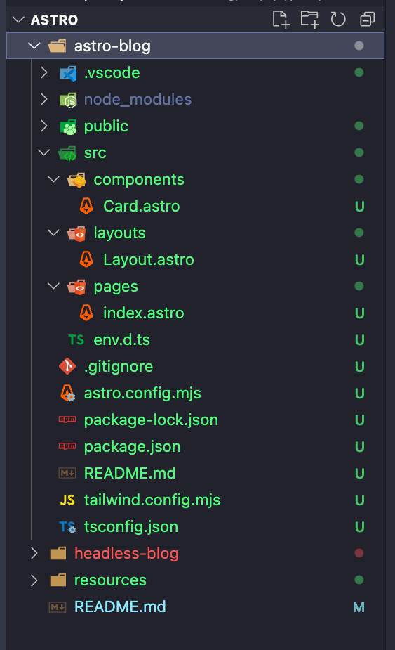

One thing you might find new is the .astro files. Astro, as mentioned in the introduction, comes with its component file. Similar to frameworks such as Vue, it is a single-file component where the file houses all of the JS, HTML, and styles as one single file.

Astro also scopes each style to its relevant component, so they do not leak to other components. If you are interested in knowing more about the folder structures and files of Astro, visit [this part](https://docs.astro.build/core-concepts/project-structure/) of the section in the Astro documentation.

Heads up!

Astro supports other frameworks and styling options. We are choosing HTML, JS and Tailwind for this tutorial.

If you want to learn more about the other options, check for other renderers and styling options.

But now, let's create our layout.

**Creating the layout**

I quickly drew a simple mockup to visually what we will be building. To keep things simple and straight forward let building only two pages

1. Blog listing page
2. Single blog item page

The blog listing page will roughly look like below.


The single blog item would look this below


First and foremost, let start creating the base layout we can paste the following code in `/src/layouts/Layout.astro` component.

```astro
---
interface Props {
  title: string;
}

const { title } = Astro.props;
---

<!doctype html>
<html lang="en">
  <head>
    <meta charset="UTF-8" />
    <meta name="description" content="Astro description" />
    <meta name="viewport" content="width=device-width" />
    <link rel="icon" type="image/svg+xml" href="/favicon.svg" />
    <meta name="generator" content={Astro.generator} />
    <title>{title}</title>
  </head>
  <body>
    <main>
      <header class="shadow mb-8">
        <div>
          <a
            href="/"
            class="block text-black text-2xl font-bold text-center py-4"
          >
            Astro Blog
          </a>
        </div>
      </header>
      <div class="container mx-auto my-4">
        <slot />
      </div>
    </main>
  </body>
</html>

<style is:global></style>
```

One thing to notice is that all of this code is wrapped between two `--- /` code fences. This is the Frontmatter Script part of the Astro component, which allows dynamic building components.

If you want to learn more about the layouts in Astro, check [this](https://docs.astro.build/core-concepts/layouts/) section in the documentation.

**Building out the UI Components**

Before we start putting everything together, let's individually create all the UI necessary components. Having a look at the UI, I am going to create 3 components

1. BlogGrid
2. BlogGridItem
3. SingleBlogItem

Let's start by creating the following files under the `/src/components` directory.

**Creating the blog grid items.**

Create a file under `src\components\BlogGridItem.astro` and copy the following lines of code

```astro
 ---
const { post } = Astro.props;
const { slug, featuredImage, title, excerpt, author } = post.attributes;
const url = import.meta.env.STRAPI_URL;

const authorImage = author.data.attributes.bioImage.data.attributes.url || null;
const postImage = featuredImage.data.attributes.url || null;
---

<div
  class="rounded-md overflow-hidden shadow-sm p-4 transition-transform h-auto"
>
  <a href={`/post/${slug}`}>
    <div class="rounded-md h-48 w-full overflow-hidden">
      
    </div>
    <div>
      <h1 class="my-2 font-bold text-xl text-gray-900">{title}</h1>
      <p class="my-2 text-gray-700 line-clamp-3">{excerpt}</p>
    </div>
    <div class="flex justify-between my-4 items-center">
      <div class="flex space-x-2 items-center overflow-hidden">
        
        <p class="font-medium text-xs text-gray-600 cursor-pointer">
          {author?.name}
        </p>
      </div>
      <div class="inline-flex rounded-md">
        <a
          href={`/post/${slug}`}
          class="inline-flex items-center justify-center px-5 py-2 border border-transparent text-base font-medium rounded-md text-white bg-yellow-500 hover:bg-yellow-400"
        >
          Read article
        </a>
      </div>
    </div>
  </a>
</div>

```

**note**: that we are using an env variable above. For us to have access to it. Create `.env` file in the root of your Astro project and add the following.

```env
  STRAPI_URL=http://localhost:1337
```

By looking at that code, you might have deduced that BlogGridItem components accept a single post as a prop.

In `line 3` we are destructing the prop to get all the keys from a single post. We had a look at the API response earlier for a single post. That is the same JSON key we are destructing in this line.

Another point to know is the `href` attribute of both `<a>` tag is pointing to `/post/slug`. This would make sense later on when we start creating pages.

We are appending the Strapi URL to the img src because Strapi does not append it by default.

**Creating the blog grids**

Create a file under `src\components\BlogGrid.astro` and paste the following code

```astro
---
import BlogGridItem from "./BlogGridItem.astro";
const { posts } = Astro.props;
---

<div class="grid grid-cols-3 gap-6">
  {
    posts.data && posts.data.length > 0
      ? posts.data.map((post) => <BlogGridItem post={post} />)
      : "No posts founds"
  }
</div>

```

The `BlogGrid` component is a container with a list of `BlogGridItems`. You can notice it accepts a post, a prop, and maps it to the `BlogGridItem` component while passing the single Post as the post prop.

Creating the single blog item.

This particular component can be arguable to make as a page, but I will make this a component in this tutorial. Go ahead a create a file under `src\components\SingleBlogItem.jsx` and copy and paste the following lines of code.

```astro
    ---
import { marked } from "marked";
import { formatDistance, format } from 'date-fns';

const { post } = Astro.props;

const { featuredImage, title, content, author, readingTime, publishedAt } = post.attributes;
const url = import.meta.env.STRAPI_URL;

const authorImage = author.data.attributes.bioImage.data.attributes.url || null;
const postImage = featuredImage.data.attributes.url || null;
---

<div class="container mx-auto">
  <div class="w-full flex justify-end rounded-md">
    <a
      href={`/`}
      class="inline-flex items-center justify-center px-5 py-2 border border-transparent text-base font-medium rounded-md text-white bg-yellow-500 hover:bg-yellow-400"
    >
      Back
    </a>
  </div>
  <div class="my-4 text-center">
    <h1 class="text-center text-4xl leading-tight text-gray-900 my-4 font-bold">
      {title}
    </h1>
    <div class="text-gray-500 flex justify-center items-center space-x-2">
      <span class="flex space-x-2 items-center overflow-hidden">
        
        <p class="font-medium text-xs text-gray-600 cursor-pointer">
          {author?.name}
        </p>
      </span>
      <span>&middot;</span>
      <span>{format(new Date(publishedAt), 'MM/dd/yyyy')}</span>
      <span>&middot;</span>
      <span>{readingTime}</span>
    </div>
  </div>
  <div class="rounded-md h-56 w-full overflow-hidden">
    
  </div>
  <article class=" prose max-w-full w-full my-4">
    <div class="rich-text" set:html={marked.parse(content)}  />
  </article>
</div>

<style is:global>

  /*******************************************
  Rich Text Styles
  *******************************************/

  /* Headers */
  article .rich-text h1 {
    @apply text-4xl font-bold mb-8 text-gray-800;
  }

  article .rich-text h2 {
    @apply text-3xl font-bold mb-8 text-gray-800;
  }

  article .rich-text h3 {
    @apply text-2xl font-bold mb-6 text-gray-800;
  }

  article .rich-text h4 {
    @apply text-xl font-bold mb-4 text-gray-800;
  }

  article.rich-text h5 {
    @apply text-lg font-bold mb-4 text-gray-800;
  }

  article .rich-text h6 {
    @apply text-base font-bold mb-4 text-gray-800;
  }

  /* Horizontal rules */
  article .rich-text hr {
    @apply text-gray-800 my-8;
  }

  article .rich-text a {
    @apply text-gray-900 underline text-xl leading-relaxed;
  }

  /* Typographic replacements */
  article .rich-text p {
    @apply mb-8 text-xl leading-relaxed text-gray-700;
  }

  /* Emphasis */
  article .rich-text strong {
    @apply font-bold text-xl leading-relaxed;
  }

  article .rich-text em {
    @apply italic text-xl leading-relaxed;
  }

  article .rich-text del {
    @apply line-through text-xl leading-relaxed;
  }

  /* Blockquotes */
  article .rich-text blockquote {
    @apply border-l-4 border-gray-400 pl-4 py-2 mb-4;
  }

  /* Lists */
  article .rich-text ul {
    @apply list-disc pl-4 mb-4 text-gray-800;
  }

  article .rich-text ol {
    @apply list-decimal pl-4 mb-4 text-gray-800;
  }

  article .rich-text li {
    @apply mb-2 text-gray-800;
  }

  article .rich-text li > ul {
    @apply list-disc pl-4 mb-2;
  }

  article.rich-text li > ol {
    @apply list-decimal pl-4 mb-2;
  }

  /* Code blocks */
  article .rich-text pre {
    @apply font-mono text-gray-800 text-gray-800 rounded p-4  my-6;
  }

  article .rich-text code {
    @apply font-mono text-gray-800 text-gray-800 rounded px-2 py-1;
  }

  /* Tables */
  article .rich-text table {
    @apply w-full border-collapse text-gray-800 my-6;
  }

  article .rich-text th {
    @apply text-gray-800 text-left py-2 px-4 font-semibold border-b text-gray-800;
  }

  article .rich-text td {
    @apply py-2 px-4 border-b text-gray-800;
  }

  /* Images */
  article .rich-text img {
    @apply w-full object-cover rounded-xl my-6;
  }

  /* Custom containers */
  article .rich-text .warning {
    @apply bg-yellow-100 border-yellow-500 text-yellow-700 px-4 py-2 rounded-lg mb-4;
  }
</style>

```

You might notice that we have to install to packages marked and date-fns. We have to install marked because, as discussed earlier, Strapi's rich text editor by default only supports Markdown, but you always have the options to replace it with a text editor of your choice.

We are installing date-fns because it's a lightweight date manipulating library. We are using it here to show how old the Post has been since posting.

We will also install the qs library that will allow us to build our query strings using object notation.

Let's go ahead and install the following libraries. Open your terminal in the project directory or if you are using VS Code, open your terminal and paste the following command.

```bash
    yarn add marked date-fns qs
```

Further looking at the code, you might notice that we are overriding the default img component to add the local Strapi Url here as well.

## Creating the Pages

We are finally ready to create the pages to put everything together. We have already interacted with the `index.astro` page earlier.

Unlike other Astro components, the files in the `.astro` inside the pages directory handle routing, data loading, and templating.

Like all popular frameworks, Astro is also based on file-based routing, meaning, every `.astro` file you create in the pages directory is treated as a route.

Note: `.md` files are also treated as routes if created inside pages directory, but any other file extensions are not. You can find more about Astro [pages](https://docs.astro.build/core-concepts/astro-pages/) here in the documentations.

**Creating the main page**

To build our main page, open your `index.astro` file and paste the following lines of code.

```astro
---
import qs from "qs";

import Layout from "../layouts/Layout.astro";
import BlogGrid from "../components/BlogGrid.astro";

let url = import.meta.env.STRAPI_URL + "/api/posts";

const query = qs.stringify({
  populate: {
    featuredImage: {
      fields: ["name", "width", "height", "url"],
    },
    author: {
      populate: {
        bioImage: {
          fields: ["name", "width", "height", "url"],
        },
      },
    },
    category: {
      populate: true,
    },
  },
});

const posts = await fetch(url + "?" + query).then((response) =>
  response.json()
);
---

<Layout title="Welcome to Astro.">
  <BlogGrid posts={posts} />
</Layout>


```

With the couple-few lines in the top, we imported the needed components, the `Layout` and the `BlogGrid`. 

Following that we are using fetch to send a request to Strapi to pull all the blog posts. Since Astro supports top-level await, we do not need to have an async function.

Let move to the single post item.

**Creating a single blog item page**

Since Astro uses file-based routing, it supports dynamic parameters using `[bracket]` notation into the filename. This allows mapping a specific file to make different routes.

Create a file under `pages/post/[slug].astro`. Because this has bracket notation, this route will be mapped to anything that follows `/post`. Eg: `/post/hello-world, /post/lorem-ipsum`, etc.

Copy the following lines of code to the newly created files

```astro
---
import qs from "qs";
import Layout from "../../layouts/Layout.astro";
import SingleBlogItem from "../../components/SingleBlogItem.astro";

export async function getStaticPaths() {
  let url = import.meta.env.STRAPI_URL + "/api/posts";

  const query = qs.stringify({
  populate: {
    featuredImage: {
      fields: ["name", "width", "height", "url"],
    },
    author: {
      populate: {
        bioImage: {
          fields: ["name", "width", "height", "url"],
        },
      },
    },
    category: {
      populate: true,
    },
  },
});

  const data = await fetch(url + "?" + query).then(response => response.json());
  return data.data.map((post) => {
    return {
      params: { slug: post.attributes.slug },
      props: { post },
    };
  });
}

const { post } = Astro.props;
---

<Layout title={post.attributes.title}>
  <SingleBlogItem post={post} />
</Layout>

```

One important thing to keep in mind is that pages using dynamic routes must export a [getStaticPaths()](https://docs.astro.build/reference/api-reference/#getstaticpaths) function returning all the names of the `files/pages` it should generate. If you have a background in Next.js and a simple framework, you might be familiar with this concept.

In the `getStaticPaths()` function, we are doing similar to what we did in the `index.astro` file getting all the Post, but this Time we return only the slug as a request parameter.

If you recall, when creating the blog grid item component, we had a `href` that pointed to `/posts/${slug}`, in that we realized the slug changes based on the Post. That particular anchor tag points to the page we just created.

We extract the slug parameter from the URL using the handy Astro.request.params object to get the exact Post. We query Strapi for the Post by slug, using Strapi's [Content API filters](https://strapi.io/documentation/developer-docs/latest/developer-resources/content-api/content-api.html#filters). This is why we never implemented a custom endpoint to get the Post by the slug.

Moving to the HTML part of the component, we simply wrap the `SingleBlogItem` component with the `Layout` while passing the queried Post as props to the component. The `Layout`, an Astro component, still accepts props we declared earlier in the frontmatter script.

And we are done! Pat yourself in the back and start up the dev server using `yarn dev`

## Conclusion

In this tutorial, we looked that how we can use Strapi and Astro to build a simple blog which super fast, SEO friendly, and, most importantly, ships no JavaScript.

We were able to build a complete backend using Strapi in a matter of minutes rather than spending Time figuring out building the APIs, handling image uploads, and building a GUI to manage posts.

Using Astro, we could get started by simply using our knowledge of HTML to make a complete blog site.

If you are further interested in deploying to any static hosting, you can follow the [deployment guide](https://docs.astro.build/guides/deploy/) given by Astro

You can find the complete code for this tutorial [here on GitHub](https://github.com/PaulBratslavsky/strapi-astro-blog-post).

Drop a comment to let me know what you thought of this article.
# astro-coding-after-thirty-site
